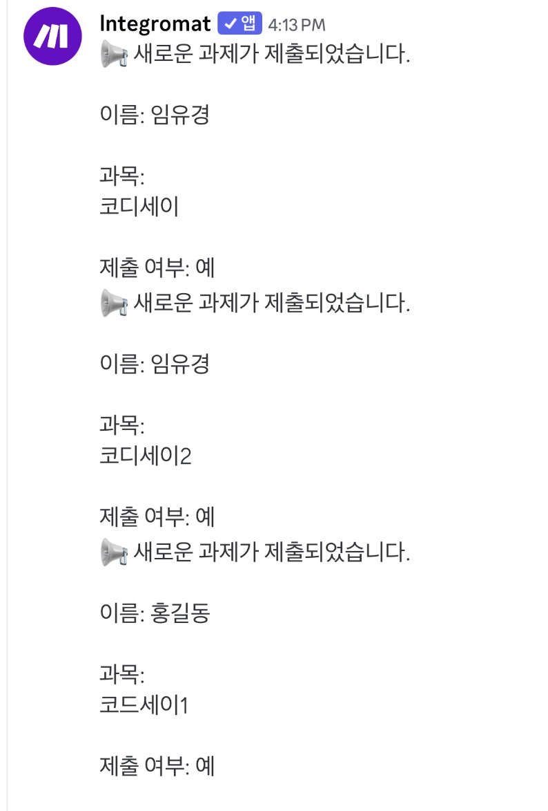
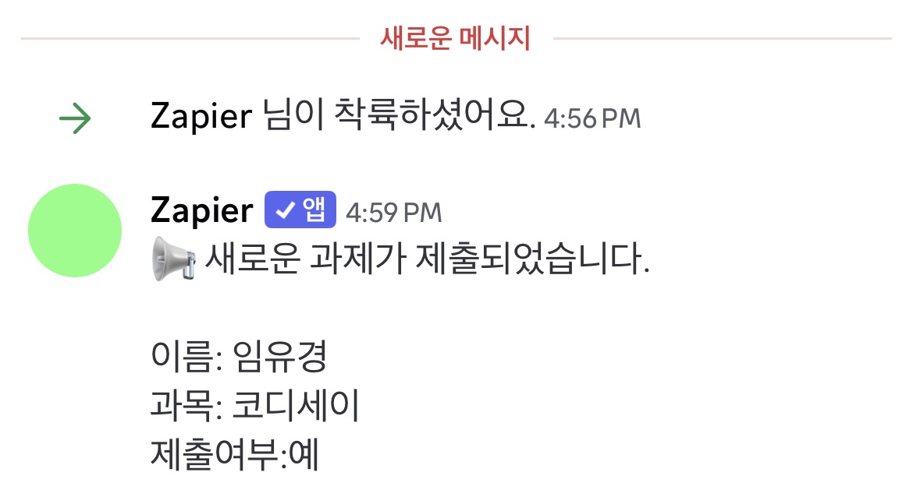

# No-Code Automation Workflow Project

## 프로젝트 소개

본 프로젝트에서는 노코드 자동화 도구인 **Make**와 **Zapier**를 활용하여 동일한 자동화 워크플로우를 구현하고 두 도구를 비교 분석하였다.

또한 반복적으로 수행하는 업무를 자동화하는 파이프라인을 직접 설계하고 구현하여 자동화 과정과 동작 원리, 그리고 확장 가능성 학습하였다.

---

# 프로젝트 1. 자동화 도구 비교 구현

## 자동화 주제

Google Form 응답이 Google Sheets에 저장되면 제출 여부를 확인한 후 Discord 채널로 자동 알림을 전송하는 워크플로우를 구현하였다.

---

## 워크플로우 구조

```
Google Form 제출

↓

Google Sheets 저장

↓

Filter (제출 여부 = 예)

↓

Discord 메시지 전송
```

---

## 구글 시트


## Make 구현

### 사용 모듈

|구분|내용|
|---|---|
|Trigger|Google Sheets - Watch New Rows|
|Filter|제출 여부 = "예"|
|Action|Discord - Send a Message|

### 구현 화면


### 실행 결과



---

## Zapier 구현

### 사용 모듈

|구분|내용|
|---|---|
|Trigger|Google Sheets - New Spreadsheet Row|
|Filter|제출 여부 = "예"|
|Action|Discord - Send Channel Message|

### 구현 화면


### 실행 결과



---

# Make와 Zapier 비교 분석

|비교 항목|Make|Zapier|
|---|---|---|
|UI/UX|시각적인 노드 방식|단계별 리스트 방식|
|설정 난이도|초기 학습이 필요함|초보자도 쉽게 사용 가능|
|조건 분기|Filter 및 Router 지원|Filter 지원|
|실행 결과 확인|Scenario 실행 로그 제공|Task History 제공|
|무료 플랜|무료 사용량이 비교적 많음|무료 플랜 제한이 비교적 적음|

---

## Make 장점

- 시각적으로 워크플로우를 구성할 수 있다.
- 복잡한 자동화 및 조건 분기에 강하다.
- 다양한 서비스 연동이 유연하다.

### 단점

- 초기 학습 난이도가 있다.
- 구조 이해에 시간이 필요하다.

---

## Zapier 장점

- 직관적인 UI로 빠르게 설정 가능하다.
- 단순 자동화에 매우 적합하다.
  
### 단점

- 복잡한 로직 구성에 한계가 있다.
- 무료 플랜 제한이 크다.

---

## 비교 결과

복잡한 자동화나 다양한 조건 분기가 필요한 경우에는 Make가 적합하였고, 간단한 자동화를 빠르게 구축하는 경우에는 Zapier가 더 편리하였다.

---

# 프로젝트 2. 자유 주제 자동화 설계 및 구현

## 자동화 주제

Google Form 과제 제출 알림 자동화

---

## 반복 업무 정의

Google Form을 통해 제출된 내용을 확인한 후 Discord 채널에 직접 알림을 보내는 작업을 자동화하였다.

---

## 선정 도구

**Make**

### 선정 이유

- 시각적인 워크플로우 구성이 가능하다.
- Filter를 이용한 조건 분기가 쉽다.
- Google Sheets와 Discord 연동이 편리하다.

---

# Trigger / Action 개념 설명

Trigger는 워크플로우를 시작시키는 이벤트이며 외부 입력 조건이다.  
예를 들어 Google Form 제출은 사용자의 입력으로 인해 자동으로 시스템이 시작되는 Trigger이다.

Action은 Trigger 이후 실행되는 처리 단계이며, 데이터를 저장하거나 외부 서비스로 전달하는 역할을 한다.  
예를 들어 Google Sheets 저장과 Discord 메시지 전송이 Action에 해당한다.

---

# 설계 기준 (Make vs Zapier 동일성)

Make와 Zapier에서 동일한 워크플로우를 구현하기 위해 입력 이벤트(Trigger), 조건(Filter), 출력(Action)의 구조를 동일하게 유지하도록 설계하였다.  
또한 각 단계가 두 도구에서 동일한 의미로 동작하도록 1:1 매핑 기준을 적용하였다.

---

# 예외 상황 대응 (모니터링 / 재시도)

트리거 실패나 외부 API 오류를 대비하여 Google Sheets를 로그 저장소로 활용할 수 있다.  
또한 Discord 전송 실패 시 재시도 로직을 추가하여 안정성을 높이는 구조로 확장할 수 있다.

---

# 구조 확장 (모듈화 설계)

조건이 증가할 경우 하나의 시나리오에 모든 로직을 넣지 않고, Router 또는 모듈 단위로 분리하여 설계할 수 있다.  
이를 통해 유지보수성과 확장성을 높일 수 있다.

---

# 노코드 한계 및 코드 확장

노코드 도구는 빠른 자동화에는 적합하지만 복잡한 로직 처리, 대규모 데이터 처리, 예외 처리에는 한계가 있다.  
이러한 경우 Python 기반 API 자동화로 확장하면 더 유연한 데이터 처리와 고급 로직 구현이 가능하다.

---

# 테스트 데이터

|이름|과목|제출 여부|
|---|---|---|
|임유경|코디세이|예|
|임유경|코디세이1|예|
|홍길동|코디세이2|예|

---

# 결과

Google Form에 새로운 응답이 제출되면 Google Sheets에 자동으로 저장되었고, 제출 여부가 **'예'** 인 경우에만 Discord 채널로 자동 메시지가 전송되는 것을 확인하였다.

두 자동화 도구 모두 동일한 워크플로우를 정상적으로 수행하였으며, 반복적으로 수행하던 알림 작업을 자동화할 수 있었다.

---

# 느낀 점

이번 프로젝트를 통해 Trigger, Action, Filter의 개념을 실제 자동화 과정에 적용해 볼 수 있었다.

동일한 자동화를 Make와 Zapier에서 각각 구현하면서 두 도구의 사용 방식과 특징을 비교할 수 있었고, 목적에 따라 적절한 자동화 도구를 선택하는 것이 중요하다는 점을 알게 되었다.

또한 노코드 자동화만으로도 반복 업무를 효율적으로 줄일 수 있다는 점을 직접 경험할 수 있었다.
