# No-Code Automation Workflow Project

## 프로젝트 소개

본 프로젝트에서는 노코드 자동화 도구인 **Make**와 **Zapier**를 활용하여 동일한 자동화 워크플로우를 구현하고 두 도구를 비교 분석하였다.

또한 반복적으로 수행하는 업무를 자동화하는 파이프라인을 직접 설계하고 구현하여 자동화 과정과 동작 원리를 학습하였다.

---

# 프로젝트 1. 자동화 도구 비교 구현

## 자동화 주제

Google Form 응답이 Google Sheets에 저장되면 제출 여부를 확인한 후 Discord 채널로 자동 알림을 전송하는 워크플로우를 구현하였다.

---

## 워크플로우 구조

```
Google Form 제출

↓

Google Sheets 저장

↓

Filter (제출 여부 = 예)

↓

Discord 메시지 전송
```

---

## 구글 시트

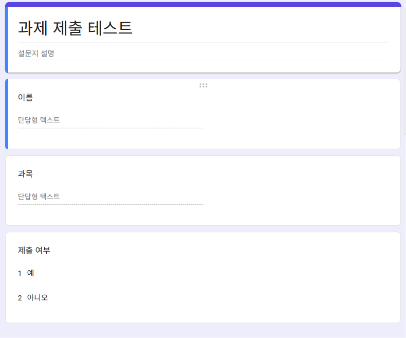

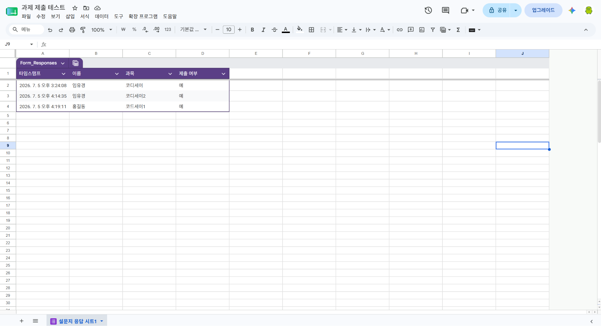

## Make 구현

### 사용 모듈

|구분|내용|
|---|---|
|Trigger|Google Sheets - Watch New Rows|
|Filter|제출 여부 = "예"|
|Action|Discord - Send a Message|

### 구현 화면

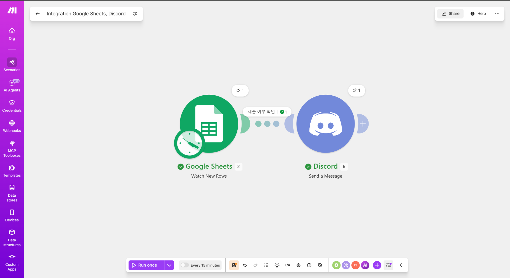

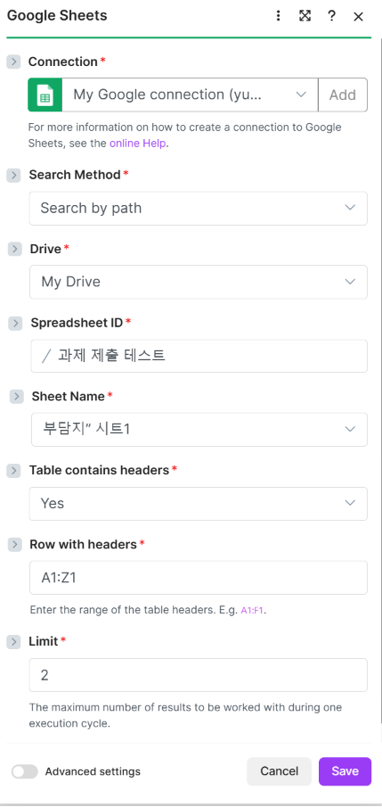

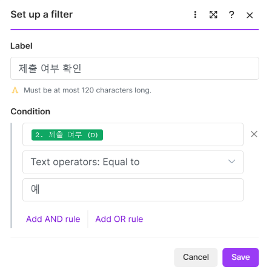

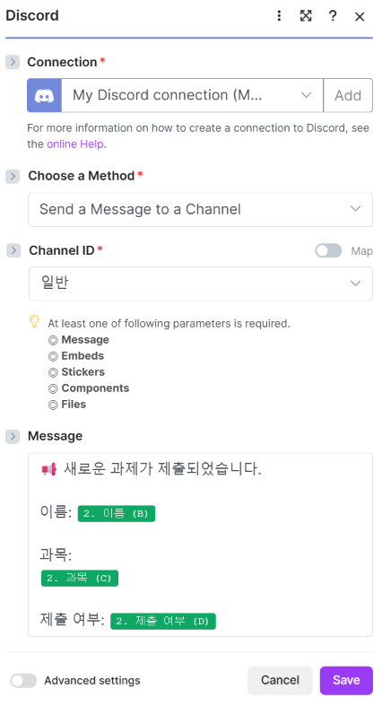

### 실행 결과

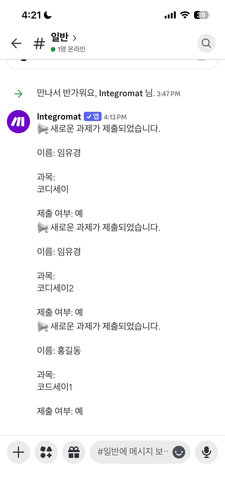

---

## Zapier 구현

### 사용 모듈

|구분|내용|
|---|---|
|Trigger|Google Sheets - New Spreadsheet Row|
|Filter|제출 여부 = "예"|
|Action|Discord - Send Channel Message|

### 구현 화면

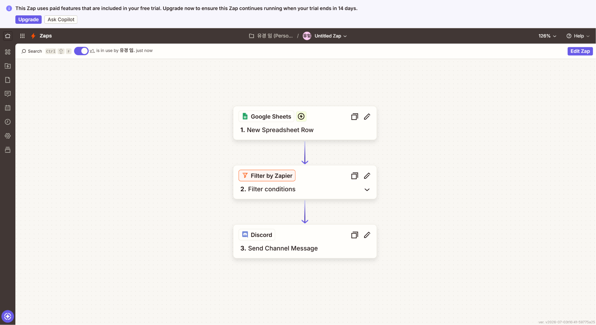

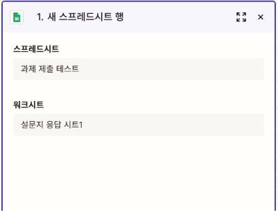

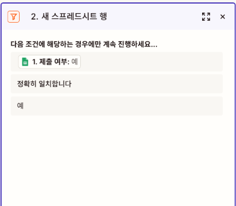

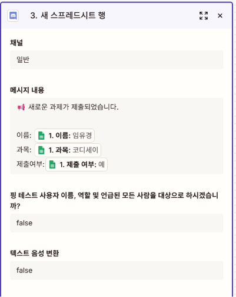

### 실행 결과


---

# Make와 Zapier 비교 분석

|비교 항목|Make|Zapier|
|---|---|---|
|UI/UX|시각적인 노드 방식|단계별 리스트 방식|
|설정 난이도|초기 학습이 필요함|초보자도 쉽게 사용 가능|
|조건 분기|Filter 및 Router 지원|Filter 지원|
|실행 결과 확인|Scenario 실행 로그 제공|Task History 제공|
|무료 플랜|무료 사용량이 비교적 많음|무료 플랜 제한이 비교적 적음|

---

## Make 장점

- 시각적으로 워크플로우를 확인하기 쉽다.
- 복잡한 자동화 구현에 적합하다.
- 다양한 서비스와 쉽게 연동된다.

### 단점

- 처음 사용할 경우 설정 과정이 다소 어렵다.
- 기능이 많아 익숙해지는 시간이 필요하다.

---

## Zapier 장점

- 인터페이스가 직관적이다.
- 간단한 자동화를 빠르게 구축할 수 있다.
- 설정 과정이 비교적 쉽다.

### 단점

- 무료 플랜의 기능 제한이 있다.
- 복잡한 자동화에는 Make보다 제약이 있다.

---

## 비교 결과

복잡한 자동화나 다양한 조건 분기가 필요한 경우에는 Make가 적합하였고, 간단한 자동화를 빠르게 구축하는 경우에는 Zapier가 더 편리하였다.

---

# 프로젝트 2. 자유 주제 자동화 설계 및 구현

## 자동화 주제

Google Form 과제 제출 알림 자동화

---

## 반복 업무 정의

Google Form을 통해 제출된 내용을 확인한 후 Discord 채널에 직접 알림을 보내는 작업을 자동화하였다.

---

## 선정 도구

**Make**

### 선정 이유

- 시각적인 워크플로우 구성이 가능하다.
- Filter를 이용한 조건 분기가 쉽다.
- Google Sheets와 Discord 연동이 편리하다.

---

## 워크플로우

```
Google Form 제출

↓

Google Sheets 저장

↓

제출 여부 확인

↓

Discord 자동 알림
```

---

## Trigger

Google Sheets - Watch New Rows

---

## Filter

제출 여부 = 예

---

## Action

Discord - Send a Message

---

## 구현 화면

> 📷 Make 시나리오 화면

---

## 실행 결과

> 📷 Discord 자동 메시지 화면

---

# 테스트 데이터

|이름|과목|제출 여부|
|---|---|---|
|임유경|코디세이|예|
|임유경|코디세이1|예|
|홍길동|코디세이2|예|

---

# 결과

Google Form에 새로운 응답이 제출되면 Google Sheets에 자동으로 저장되었고, 제출 여부가 **'예'** 인 경우에만 Discord 채널로 자동 메시지가 전송되는 것을 확인하였다.

두 자동화 도구 모두 동일한 워크플로우를 정상적으로 수행하였으며, 반복적으로 수행하던 알림 작업을 자동화할 수 있었다.

---

# 느낀 점

이번 프로젝트를 통해 Trigger, Action, Filter의 개념을 실제 자동화 과정에 적용해 볼 수 있었다.

동일한 자동화를 Make와 Zapier에서 각각 구현하면서 두 도구의 사용 방식과 특징을 비교할 수 있었고, 목적에 따라 적절한 자동화 도구를 선택하는 것이 중요하다는 점을 알게 되었다.

또한 노코드 자동화만으로도 반복 업무를 효율적으로 줄일 수 있다는 점을 직접 경험할 수 있었다.
